# ClinicVet: Arquitetura 

A ClinicVet é uma clínica veterinária **fictícia** usada como cenário para demonstrar soluções tecnológicas seguindo padrões corporativos.

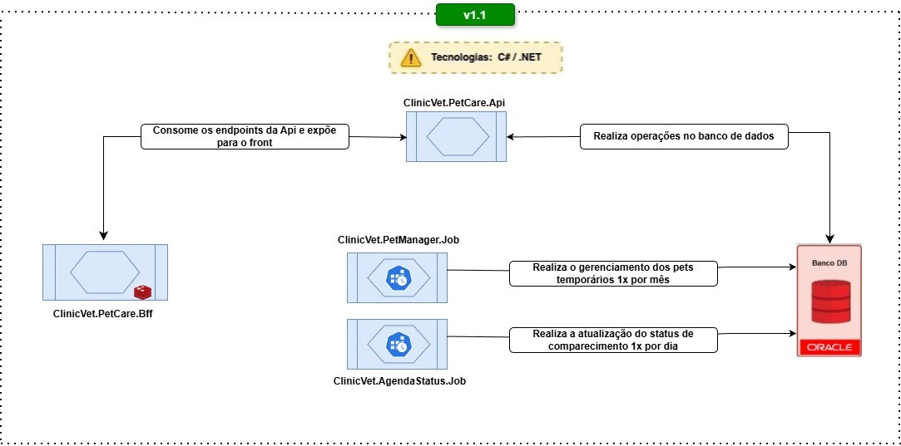

  <strong>Esquema arquitetural com autoria, implementação e documentação de José Julio.</strong>

 

---

# Sumário

- [Fluxo de Negócio](#fluxo-de-negócio)
- [Estrutura dos Projetos](#estrutura-dos-projetos)
- [Componentes de Configuração Reutilizáveis](#componentes-de-configuração-reutilizáveis)
- [Documentação dos Endpoints](#documentação-dos-endpoints-swagger)
- [Serviços de Processamento (CronJobs)](#serviços-de-processamento-cronjobs)
- [Declaração de Conformidade e Segurança dos Dados](#declaração-de-conformidade-e-segurança-dos-dados)
- [Testes dos Endpoints](#testes-dos-endpoints-postman)
   - [Post](#post)
   - [Patch](#patch)
   - [Parâmetros de Obrigatoriedade](#parâmetros-de-obrigatoriedade)
   - [Get](#get)
   - [Estratégia de Cache](#estratégia-de-cache-redis)
   - [Acesso aos Registros Temporários](#acesso-aos-registros-temporários)
- [Estratégia de Cache](#estratégia-de-cache-redis)
- [Testes de Unidade](#testes-de-unidade)
- [Banco de Dados](#banco-de-dados)
- [Execução em Ambiente Local](#executando-o-projeto-em-ambiente-local)
- [Observação Importante](#observação-importante)
- [Considerações Finais](#considerações-finais)

 

---

# Fluxo de Negócio

A **ClinicVet.PetCare.Api** é o núcleo do sistema.
Ela é responsável por cadastrar tutores e seus pets, além de permitir agendamentos de consultas e procedimentos veterinários. A partir desses cadastros, todo o fluxo operacional é estruturado.

Para complementar o funcionamento da clínica, existem dois CronJobs que automatizam tarefas importantes:

**1. ClinicVet.AgendaStatus.Job (Atualização diária do status das consultas)**

No final de cada dia, esse serviço verifica todos os pets que tinham consulta marcada.
Se algum deles não compareceu, o status é alterado automaticamente de **"agendado"** para **"ausente"**.

Benefícios:

- A atendente só precisa registrar quem realmente chegou (check-in).

- O controle diário fica mais simples e confiável.

- A agenda do dia seguinte já fica organizada.

**2. ClinicVet.PetManager.Job (Gerenciamento mensal de pets temporários)**

Esse serviço cuida de uma situação especial:
pets que estão sob responsabilidade temporária de um tutor, como em situações de resgate, guarda provisória ou atendimento emergencial.

Uma vez por mês, o PetManager:

- Identifica esses pets temporários.

- Move seus dados da tabela principal para uma tabela específica de históricos temporários.

- Remove os registros antigos da tabela de origem para manter o banco otimizado.

- Mantém todo o histórico preservado em um fluxo separado.

Para facilitar a consulta, foi criado um endpoint exclusivo que permite filtrar e visualizar esses dados de maneira detalhada.

**3. ClinicVet.PetCare.Bff (Camada de acesso simplificada)**

  O ClinicVet.PetCare.Bff funciona como um “porteiro” da API.
  Ele não cria regras novas, apenas:

- Consome os endpoints da API,

- Expõe os dados de forma simplificada para o front-end,

- Possui implementação de cache para deixar as consultas mais rápidas.

Essa camada reduz a dependência direta do front-end com a API e melhora a performance geral das buscas.  

---

# Estrutura dos Projetos

A solução segue uma arquitetura padronizada para todos os serviços ClinicVet, composta por camadas bem definidas que garantem isolamento, testabilidade e extensibilidade.
Esse padrão é replicado em todos os projetos, mantendo uma organização previsível e facilitando a manutenção.

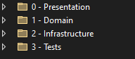

 

---

# Componentes de Configuração Reutilizáveis

A infraestrutura de configuração foi organizada em módulos NuGet independentes, integrados à aplicação por meio de Dependency Injection sem necessidade de referências diretas.
Isso garante um alto nível de desacoplamento, padronização e reutilização. Esse template funciona como uma base sólida para qualquer novo sistema, permitindo construir aplicações 
de forma escalável, consistente e totalmente alinhada às boas práticas corporativas, independentemente do domínio ou complexidade.

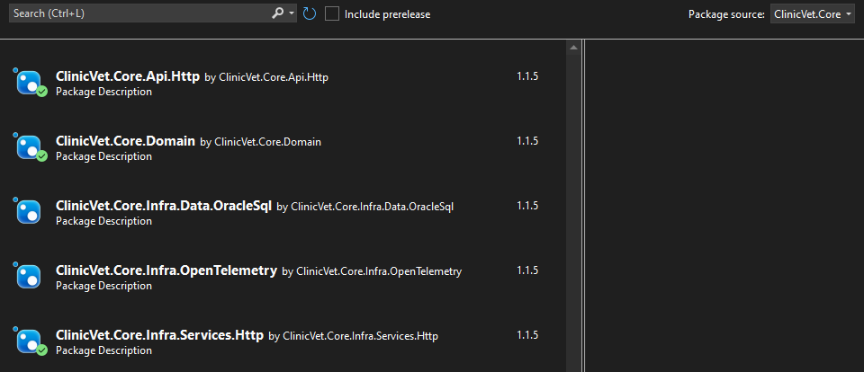

 

---

# Documentação dos Endpoints (Swagger)

A documentação dos serviços foi estruturada usando Swagger (OpenAPI), garantindo clareza, rastreabilidade e facilidade de consumo para qualquer desenvolvedor que utilize o ecossistema ClinicVet. 
Essa seção demonstra visualmente que a API é organizada, padronizada e segue boas práticas de versionamento e documentação.

<h2 style="color:darkorange;">ClinicVet.PetCore.Api (API Principal)</h2>

A API principal expõe operações de:

- Cadastro de Tutores

- Cadastro de Pets

- Agendamentos

- Consultas

- Atualização de Status

- Fluxos complementares de negócio

Imagem do Swagger da API:

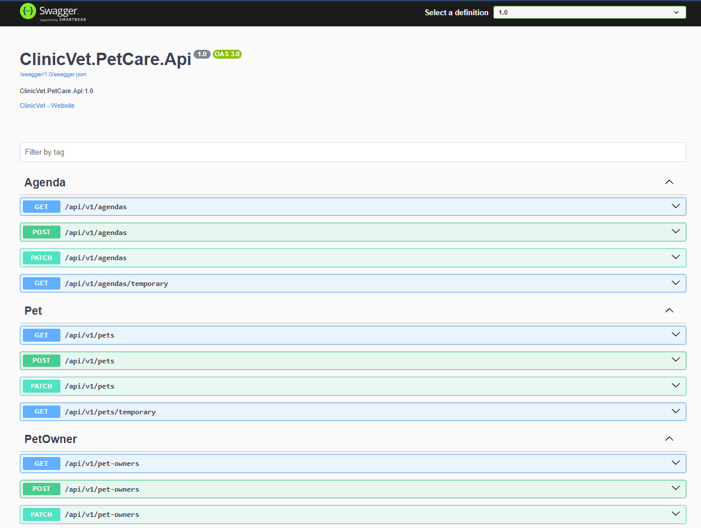

 

<h2 style="color:darkorange;">ClinicVet.PetCore.BFF (Backend for Frontend)</h2>

O BFF atua como uma camada de otimização, adicionando:

- Cache distribuído

- Endpoints refinados para consumo do front-end

- Padronização de responses

- Redução de carga da API principal

Imagem do Swagger do BFF:

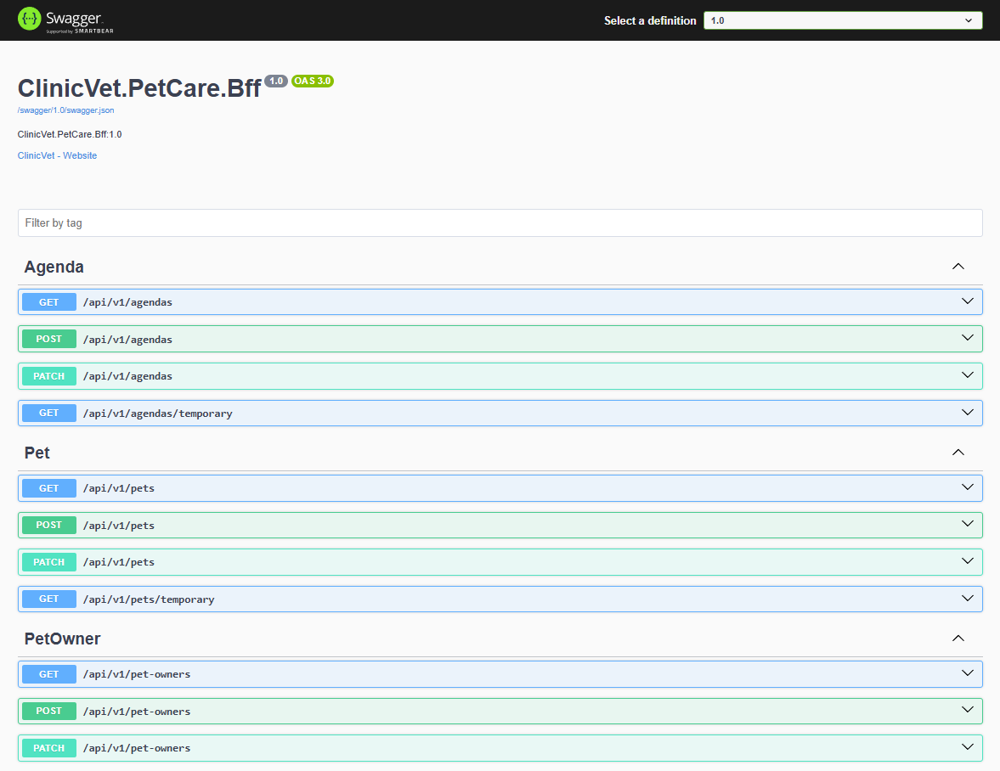

  

---

# Serviços de Processamento (CronJobs)

Os Jobs não possuem interface REST (pois são executores autônomos), mas expõem:

- Logs estruturados

- Métricas de execução

- Configurações via appsettings

- Scheduler interno

<h2 style="color:darkorange;">ClinicVet.AgendaStatus.Job</h2>

A atualização do status dos agendamentos é executada por este CronJob, responsável por identificar, ao final de cada dia, todos os registros com status "agendado" cujas consultas não foram realizadas.
Para esses casos, o serviço atualiza automaticamente o status para "ausente", garantindo consistência no fluxo operacional e reduzindo a necessidade de intervenção manual pela equipe da clínica.
A execução e o resultado desse processamento podem ser visualizados no log demonstrado a seguir.

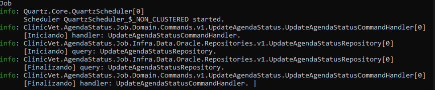

 

   

     A imagem abaixo mostra o status da consulta no banco de dados 
     <strong>antes</strong> da execução do CronJob.
   

     
   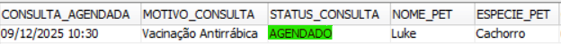

 

   

     A imagem abaixo mostra o status da consulta no banco de dados 
     <strong>depois</strong> da execução do CronJob.
   

     
   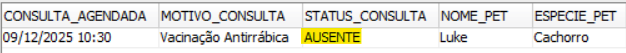

<h2 style="color:darkorange;">ClinicVet.PetManager.Job</h2>

O CronJob.PetManager é responsável por gerenciar os registros de pets e agendamentos vinculados a tutores temporários.
Durante sua execução programada, o job identifica todos os pets que pertencem a tutores que não são responsáveis permanentes e move esses dados para estruturas temporárias, preservando o histórico sem comprometer a integridade das tabelas principais utilizadas pelo fluxo operacional da clínica. Após a transferência, os registros originais são removidos das tabelas oficiais, mantendo o ambiente de dados limpo e consistente.
A execução desse processamento pode ser acompanhada no log apresentado a seguir. O resultado da movimentação também pode ser conferido posteriormente nos endpoints de consulta de registros temporários, que serão detalhados mais adiante.

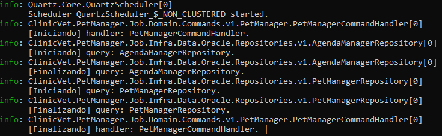

  

---

# Declaração de Conformidade e Segurança dos Dados

Todos os dados utilizados nesta documentação (nomes, endereços, telefones, documentos e demais informações) foram gerados de forma totalmente **fictícia** através da plataforma pública: https://www.4devs.com.br/ .
Nenhuma informação real, pessoal ou sensível foi utilizada durante o desenvolvimento, testes ou demonstrações deste projeto. Este material foi preparado em conformidade com as diretrizes da LGPD, respeitando integralmente os princípios de privacidade, segurança e responsabilidade no tratamento de dados. Caso qualquer informação exibida nesta documentação pareça inadequada ou possa sugerir associação indevida com dados reais, solicito que me notifique imediatamente, e ela será removida ou substituída prontamente.

 

---

# Testes dos Endpoints (Postman)

**Evidência visual: resposta real do serviço validada em ambiente local.**   

Todos os testes desse portfólio foram executados diretamente pelo ClinicVet.PetCare.Bff, que atua como um proxy da API principal.
Isso garante que a documentação evidencie não apenas o funcionamento dos endpoints, mas também a integração entre camadas, já que toda chamada passa internamente pela API antes de retornar ao cliente.

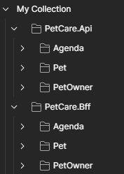
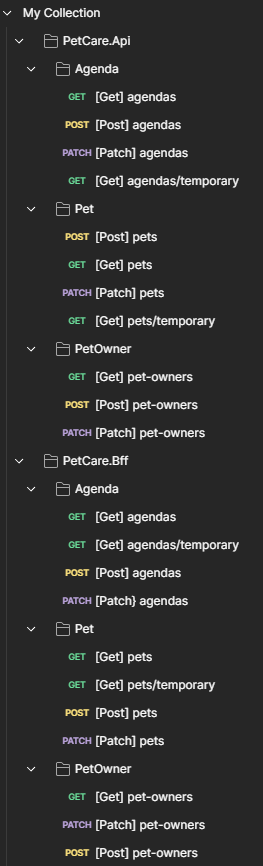

 

---

# Post

Para a criação de registros, os endpoints devem ser consumidos na ordem de tutores, pets e por último agendamentos, assegurando que o fluxo de dados seja persistido corretamente.

<h2 style="color:gold;">Criar Registro do Tutor (POST/Pet-Owners)</h2>

 - Endpoint responsável por registrar novos tutores na clínica, criando a base de identificação necessária para o vínculo com seus pets e futuros agendamentos.  

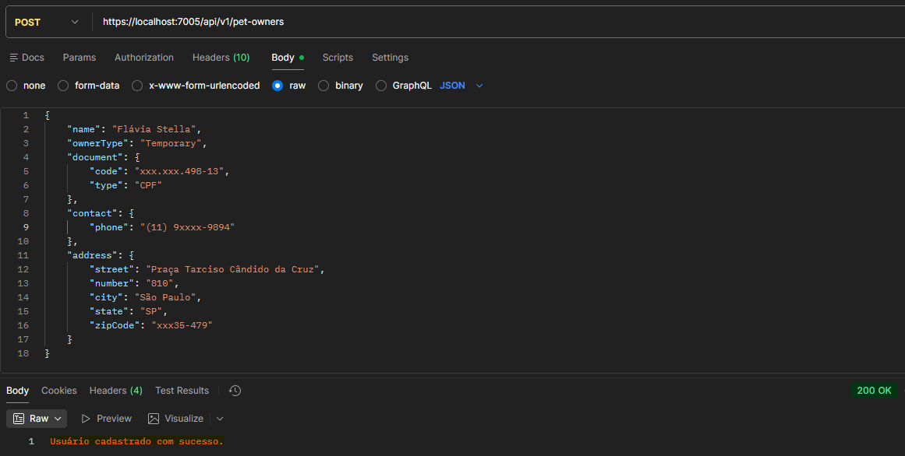

<h2 style="color:gold;">Criar Registro de Pet (POST/Pets)</h2>

 - Endpoint responsável por cadastrar pets no sistema, vinculando cada animal ao tutor já existente para garantir integridade e rastreabilidade das informações.  

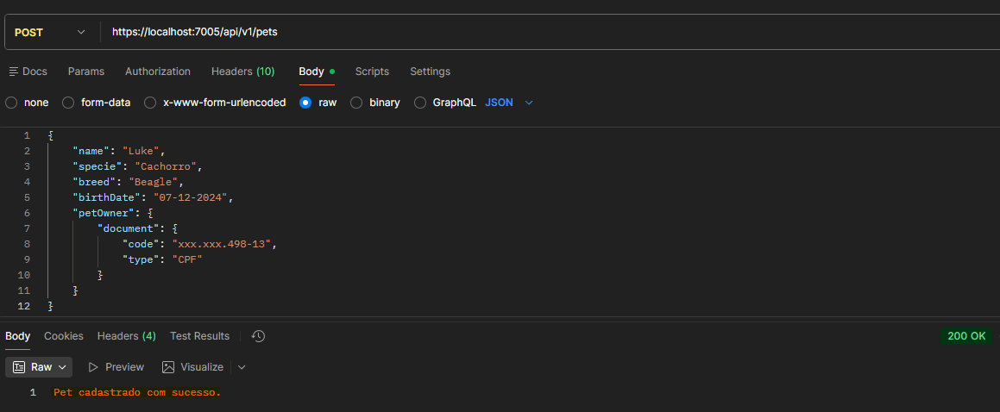

<h2 style="color:gold;">Criar Registro de Agendamento (POST/Agendas)</h2>

 - Endpoint responsável por registrar agendamentos clínicos, garantindo que o Pet esteja previamente cadastrado e corretamente vinculado a um Tutor antes da criação do compromisso.  

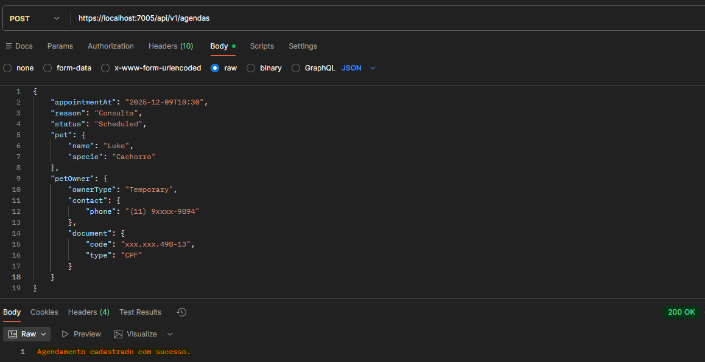

 

---

# Patch

Nos endpoints de atualização, os trechos destacados em amarelo indicam exatamente quais informações foram modificadas.Em determinados fluxos, é necessário informar o documento do tutor e o nome do pet para que o sistema localize corretamente o registro, além dos campos que deverão ser efetivamente atualizados.

<h2 style="color:mediumpurple;">Atualizar Registros do Tutor (PATCH/Pet-Owners)</h2>
  
  - Endpoint responsável por atualizar os dados cadastrados de um tutor.  

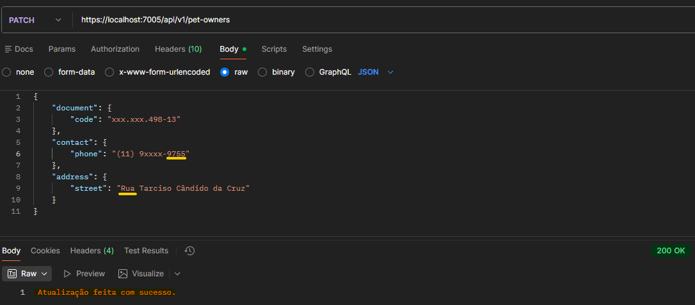

<h2 style="color:mediumpurple;">Atualizar Registros de Pet (PATCH/Pet)</h2>
  
   - Endpoint responsável por atualizar os dados cadastrados de um pet.  

<h2 style="color:mediumpurple;">Atualizar Registros de Agendamento (PATCH/Agenda)</h2>

   - Endpoint responsável por atualizar os dados cadastrados de um agendamento.  

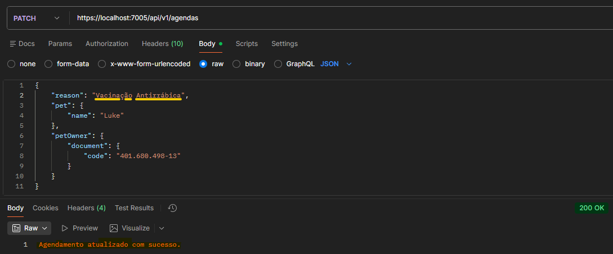

 

---

# Parâmetros de Obrigatoriedade

Nos endpoints de criação e atualização, alguns parâmetros são obrigatórios para que a operação seja concluída com sucesso. Os prints abaixo ilustram as mensagens exibidas quando esses campos não são informados. 
Vale ressaltar que outros parâmetros podem ser exigidos dependendo do fluxo e das regras específicas aplicadas em cada operação.

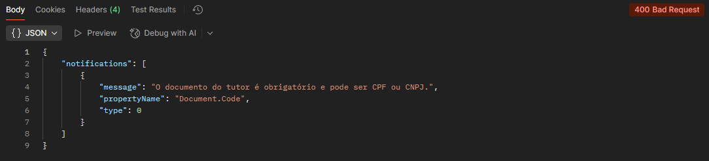
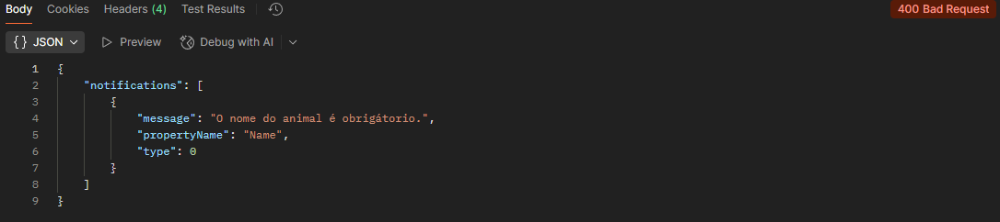

 

---

# Get

Todos os endpoints de consulta utilizam paginação. Para manter consistência nas buscas, apenas os endpoints que acessam registros temporários (tabelas de pets e agendamentos temporários) não utilizam cache.
Os demais endpoints contam com implementação de cache, reduzindo a carga sobre a API e melhorando a performance nas consultas

<h2 style="color:mediumseagreen;">Consulta de Tutor (GET/Pet-Owners)</h2>

  - Endpoint destinado à consulta de informações de tutores.  

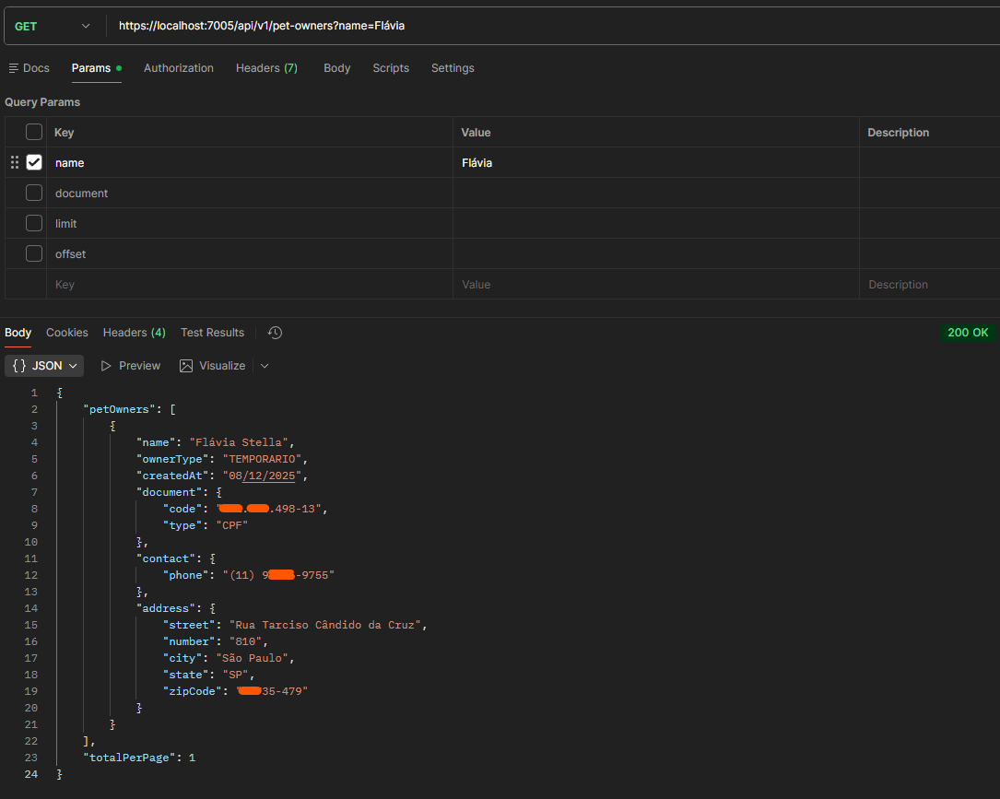

<h2 style="color:mediumseagreen;">Consulta de Pet (GET/Pets)</h2>

   - Endpoint destinado à consulta de informações de pets.  

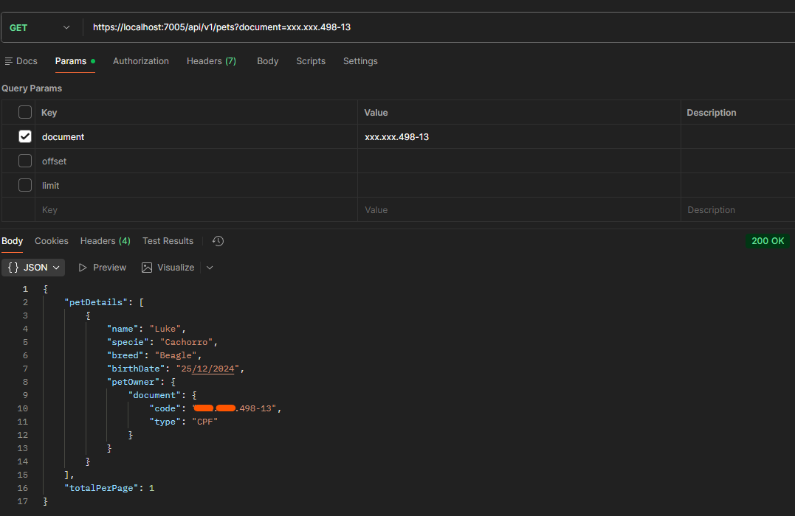

<h2 style="color:mediumseagreen;">Consulta de Agendamento (GET/Agendas)</h2>

   - Endpoint destinado à consulta de informações de agendamentos.  

    

---

## Estratégia de Cache (Redis)

  Para tornar as consultas mais rápidas e evitar chamadas desnecessárias à API, o BFF implementa cache nos endpoints mais acessados.
  Isso garante respostas imediatas quando a informação já foi buscada recentemente, reduzindo processamento e melhorando a experiência geral do sistema.
  A seguir, os prints demonstram o comportamento do cache em ação.

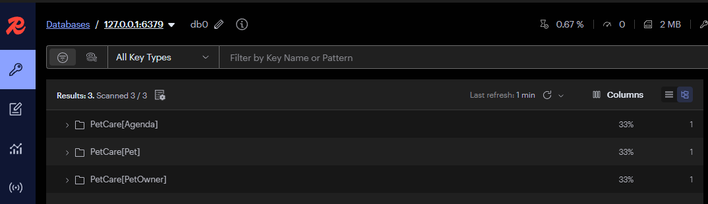

     
   
   <h2 style="color:firebrick;">Cache Tutor</h2>

   - Os resultados das consultas de Tutores são armazenados em cache, acelerando o retorno das informações e evitando chamadas desnecessárias à API.  

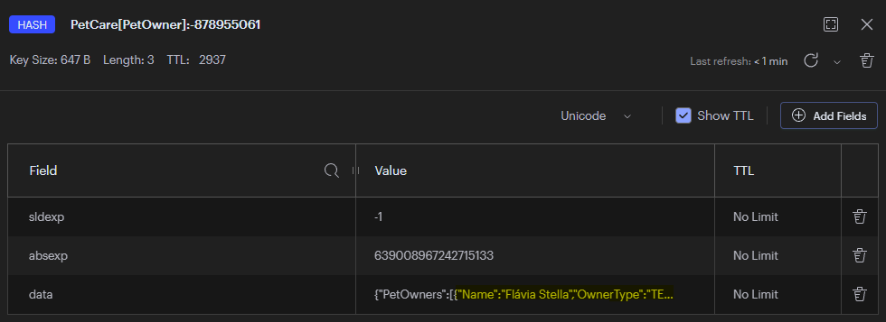

       

 <h2 style="color:firebrick;">Cache Pet</h2>

   - Os resultados das consultas de Pets são armazenados em cache, acelerando o retorno das informações e evitando chamadas desnecessárias à API.  

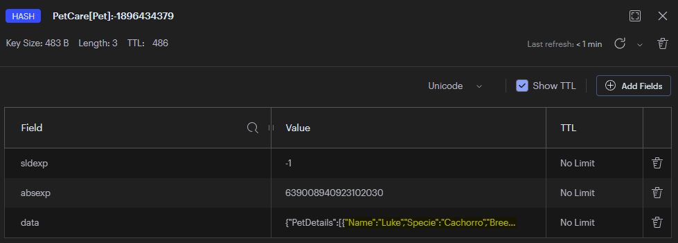

        
 
  <h2 style="color:firebrick;">Cache Agendamento</h2>

   - Os resultados das consultas de Agendamentos são armazenados em cache, acelerando o retorno das informações e evitando chamadas desnecessárias à API.  

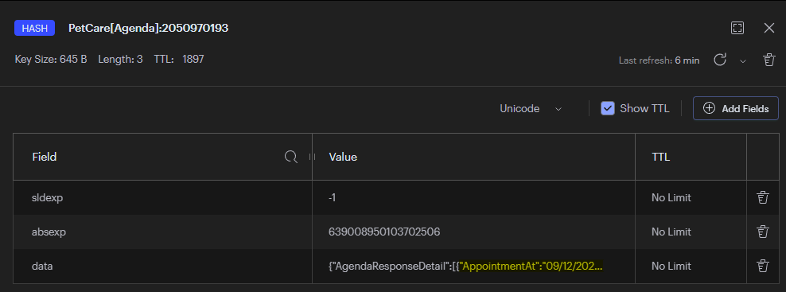

        
   
---

   # Acesso aos Registros Temporários 

   Esses endpoints permitem consultar os registros que foram movidos para as tabelas temporárias pelo CronJob(**ClinicVet.PetManager.Job**), que transfere para as tabelas temporárias apenas os registros vinculados a tutores temporários. Os testes foram executados diretamente pelo BFF, e as imagens a seguir mostram que as consultas funcionam normalmente também via Swagger.

<h2 style="color:mediumseagreen;">Consulta de Pet Temporary (GET/Pets/Temporary)</h2>

   - Esse endpoint permite consultar todos os agendamentos associados a tutores temporários, retornando apenas registros que já foram movimentados pelo PetManager.  

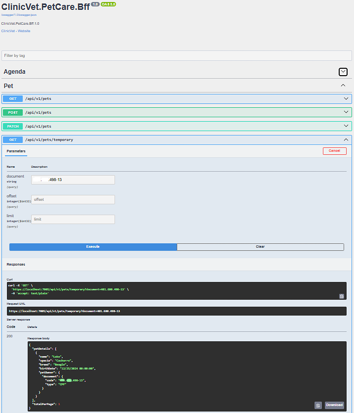

     

<h2 style="color:mediumseagreen;">Consulta de Agendamento Temporary (GET/Agendas/Temporary)</h2>

   - Esse endpoint permite consultar todos os pets associados a tutores temporários, retornando apenas registros que já foram movimentados pelo PetManager  

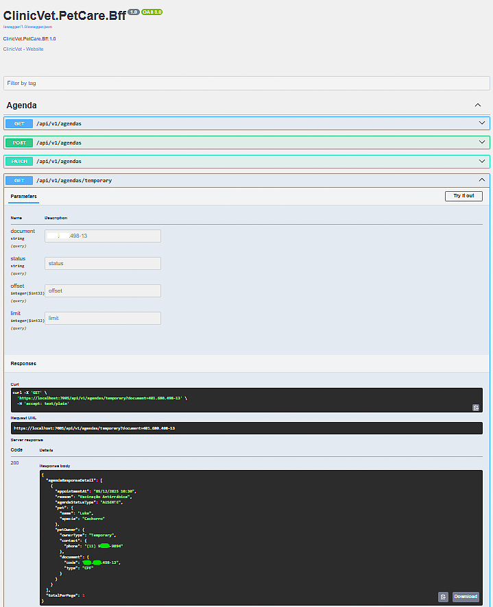

    

  ---

# Testes de Unidade

Esta documentação contempla exclusivamente os testes de unidade dos projetos API e BFF, por representarem os componentes diretamente expostos aos consumidores do serviço e por concentrarem os cenários críticos de validação. Os CronJobs também possuem testes de unidade implementados, seguindo os mesmos princípios, padrões e diretrizes aplicados aos demais projetos. Entretanto, por apresentarem estruturas similares e pela cobertura atual estar abaixo do nível considerado ideal (entre 70% e 80%), optou-se por não detalhá-los neste documento, a fim de manter a objetividade e evitar redundância de informações.
Ressalta-se que todos os testes, incluindo os referentes aos CronJobs, estão disponíveis integralmente no repositório, podendo ser consultados conforme necessidade.

**Observação:**

À medida que novas funcionalidades são adicionadas ao sistema, a cobertura de testes tende a diminuir. Isso ocorre porque as partes novas do código ainda não possuem testes implementados para elas. Por isso  é necessário atualizar e criar novos testes regularmente, para que a cobertura continue acompanhando o que foi desenvolvido e o sistema mantenha um nível adequado de qualidade e segurança.

**ClinicVet.PetCare.Api (Teste de Unidade/Coverage)**

 - A imagem abaixo apresenta os resultados dos testes unitários realizados na API, bem como a respectiva análise de cobertura.  

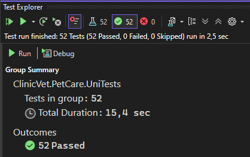
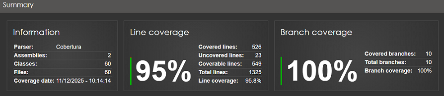

  

 **ClinicVet.PetCare.Bff (Teste de Unidade/Coverage)**

 - A imagem abaixo apresenta os resultados dos testes unitários realizados na BFF, bem como a respectiva análise de cobertura.  

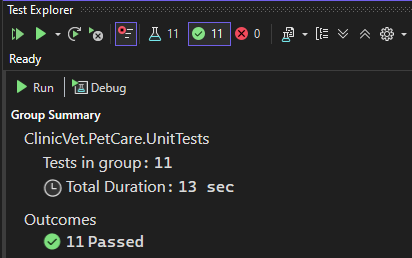
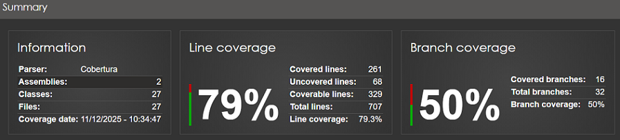

  

---

# Banco de Dados

Para a implementação deste projeto, foi utilizado o banco de dados Oracle para armazenar, gerenciar e disponibilizar as informações necessárias ao funcionamento do sistema, conforme apresentado no diagrama de arquitetura no início desta documentação. Os scripts das procedures estão disponíveis no diretório database deste projeto. Para preservar a integridade da estrutura das tabelas utilizadas pelo sistema, os scripts referentes as mesmas não serão disponibilizados.

- A imagem a seguir apresenta as evidências das tabelas criadas no banco de dados, estruturadas para atender aos requisitos funcionais e suportar o funcionamento deste projeto. 

  

- As procedures foram implementadas dentro de pacotes, de forma a agrupar procedimentos relacionados a cada fluxo do sistema. Essa abordagem facilita a organização, melhora a manutenção,  reforça a separação de responsabilidades e permite melhor encapsulamento das rotinas, conforme ilustrado na imagem a seguir. 

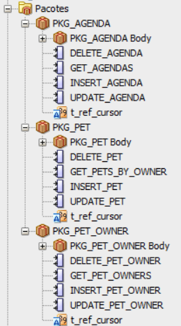

  

---

# Executando o Projeto em Ambiente Local

Para aqueles que utilizarem os projetos deste repositório, é importante destacar que a execução completa do sistema depende de componentes que fazem parte da minha infraestrutura local de desenvolvimento e que, por isso, não estão vinculados ou expostos neste portfólio. Ainda assim, todo o código-fonte apresenta de forma transparente a arquitetura, as decisões técnicas e a lógica aplicada, permitindo uma análise clara da solução desenvolvida.  

---

# Observação Importante

Apesar de toda a regra de negócio implementada, o objetivo central deste projeto é demonstrar:

- Boas práticas de arquitetura,

- Separação clara de responsabilidades,

- Uso de templates base reutilizáveis,

- Injeção via DLLs,

- Aplicação de padrões corporativos,

- Domínio organizado em camadas,

- Desenvolvimento completo em .NET e Oracle.

---

# Considerações Finais

Este projeto foi desenvolvido com foco na aplicação de boas práticas de arquitetura, organização de código e separação de responsabilidades, visando representar um cenário próximo ao de aplicações reais em ambiente profissional. Foram priorizados critérios como clareza estrutural, manutenibilidade, testes automatizados e consistência técnica. Vale destacar que este projeto não deve ser visto como uma solução final, mas como uma base funcional que ilustra a abordagem adotada para resolver os problemas e atender aos requisitos propostos. Existem áreas que podem ser aprimoradas ou evoluídas em futuras implementações, o que faz parte do ciclo contínuo de desenvolvimento. Esse processo abre espaço para melhorias, ajustes de design e expansão conforme novas necessidades surgirem.
O objetivo central deste trabalho é demonstrar domínio técnico sobre o contexto implementado, evidenciando a capacidade de estruturar soluções e tomar decisões arquiteturais, preparando o sistema para evoluções futuras de forma consistente e sustentável.
